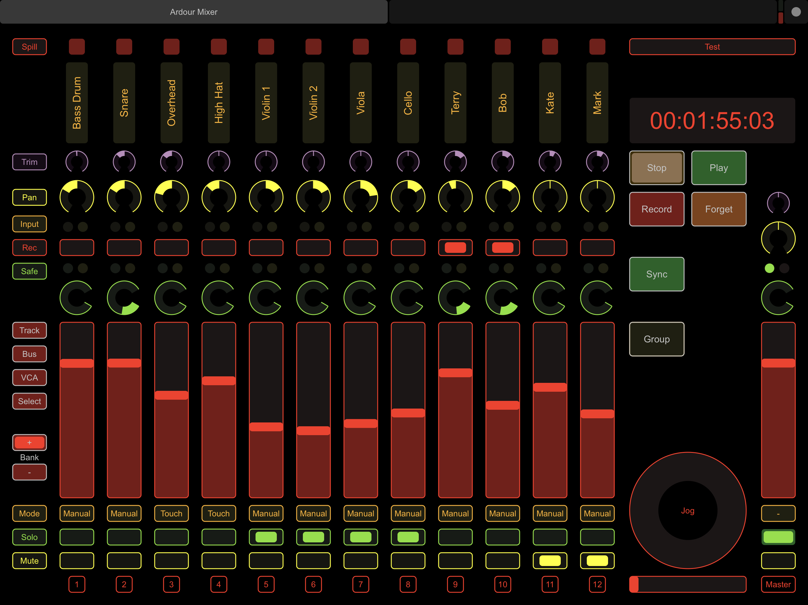

## Ardour Profiles for TouchOSC ##

### iPad Pro ###
[Ardour iPad Pro.touchosc](Ardour%20iPad%20Pro.touchosc)

A 12 channel (banking) mixer for Ardour.  I find it much easier to tweek the levels
(both manual and automation) on my iPad Pro than with the mouse.

This is still work in progress.  The mixer is pretty much finished but I am
still playing around with the track editor.

### Installing ###

* Download the required `.touchosc` file to your iPad.
* Use the Files app to move it to 'TouchOSC' folder
* Start TouchOSC and select the profile

### Spilling Strips ###

The spill feature makes it very easy to navigate your strips, however this was only
implemented in Ardour 6.  Select a **Bus** or **VCA** and then click the **spill** button at the top
of the desired set to work on those tracks.

### TODO ###

* Finish track editor
* Implement custom strips
* Enable/disable plugins
* profiles for other devices

### Development ###
This is generated by some hacky python scripts - feel free to cannibalise as
required....
